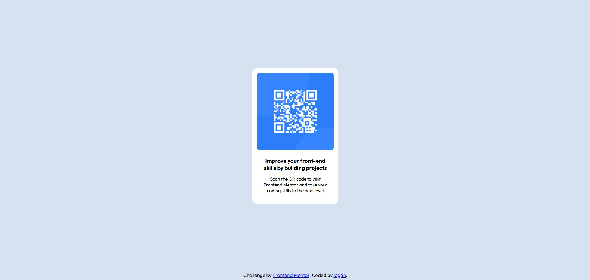

# Frontend Mentor - QR code component solution

This is a solution to the [QR code component challenge on Frontend Mentor](https://www.frontendmentor.io/challenges/qr-code-component-iux_sIO_H). Frontend Mentor challenges help you improve your coding skills by building realistic projects.

## Table of contents

- [Overview](#overview)
  - [Screenshot](#screenshot)
  - [Links](#links)
- [My process](#my-process)
  - [Built with](#built-with)
  - [What I learned](#what-i-learned)
  - [Continued development](#continued-development)
  - [Useful resources](#useful-resources)
- [Author](#author)

## Overview

### Screenshot

### Links

- Solution URL: [FM-qr-code-component Repo](https://github.com/LoganBarger/FM-qr-code-component)

## My process

During this first Frontend Mentor project, I focused on using the basics of HTML and CSS to accomplish the task. I used Flexbox to manage the spacing on the page.

### Built with

- Semantic HTML5 markup
- CSS custom properties
- Flexbox

### What I learned

Although this project was relatively simple, I discovered some better ways to complete it more efficiently. I wanted to stick to basic HTML and CSS for this project, but while trying (and failing) to get Flexbox to have proper spacing in the middle of the page with the watermark at the bottom, I quickly realized that using Bootstrap or even CSS Grid Layout might have been faster and easier.

### Continued development

I will be utilizing Bootstrap and CSS Grid Layout in future projects. Bootstrap, in particular, will help reduce the time it takes to style pages. I'm also very excited to start working with JavaScript to create more dynamic pages.

### Useful resources

- [Flexbox Froggy](https://flexboxfroggy.com/) - This website made it very easy to understand the nuances of Flexbox. The ability to quickly test out properties in a sandbox was extremely helpful.

## Author

Logan Barger

- Github - [@LoganBarger](https://github.com/LoganBarger)
- Frontend Mentor - [@LoganBarger](https://www.frontendmentor.io/profile/LoganBarger)
